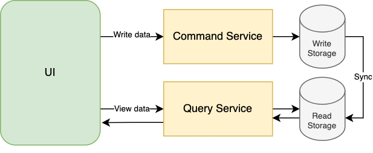
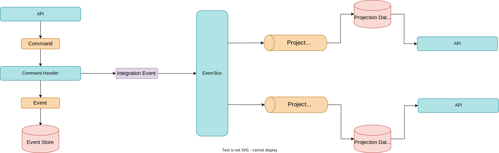

## EventSourcing-CQRS

 **This is an Event Sourcing Project. Contains my fully-own Event Store implementation with Entity Framework Core - PostgreSQL and  CQRS - Event Sourcing implemantation.**
 ### Domain

 Project domain is a simple Online Course Platform Domain. There are courses that created by Platform Instructors. An Instructor can change the course name and description of his courses, or can add sections into it. Also, he can change the status of his courses as Presenting, Activated, and Completed. Platform Users Can Join - Leave a course, or comment the courses.

 **All of these operations implemented as a Use-Case Operation in Command Project. Defined Use-Case Operations are**

 - **Create Course**
 - **Change Course Title**
 - **Change Course Description**
 - **Present Course**
 - **Activate Course**
 - **Complete Course**
 - **Add Section**
 - **Join Course**
 - **Leave Course**
 - **Comment Course**

 ### CQRS
 **CQRS is a design pattern says that command and query operations must be seperated. This seperation is can be on model based, or project based. In this project, project based seperation has been implemented.**

 

  

#### Command
 There is a Command Project which is executes domain use-case operations that we talked about above. Command project uses Event Sourcing pattern as data persistence approach.

 There is my own Event Store implementation with PostgreSQL - Entity Framework Core in the Command project. When an use-case operation executed successfully, command project raises an event and writes it into event store. 

#### Query
By using Event Sourcing, we gain a lot of advantage about data representation. We have query projects more than one these represents the read models by their own approach.

By Event Sourcing, every query project can create his own read model by his needs. When an use-case operation executed on the command side, command project sends an integration event into the Event Bus. Every query project subscribes that events, and whenever an integration event published into Event Bus, Each query project update its read model accordingly. 

### Infrastructure 
The Infrastructure Details;

- **The Command Project created on .NET 6.0 Platform, and uses some libraries such as Mediatr, Entity Framework Core, Fluent Validation. Uses postgresql as event store.**

- **Query projects uses Redis and MongoDb as Read Model Databases.**

- **As Event Bus, RabbitMQ and Mass Transit Framework has been implemented.**

You can see all the project infrastructure below.

  

